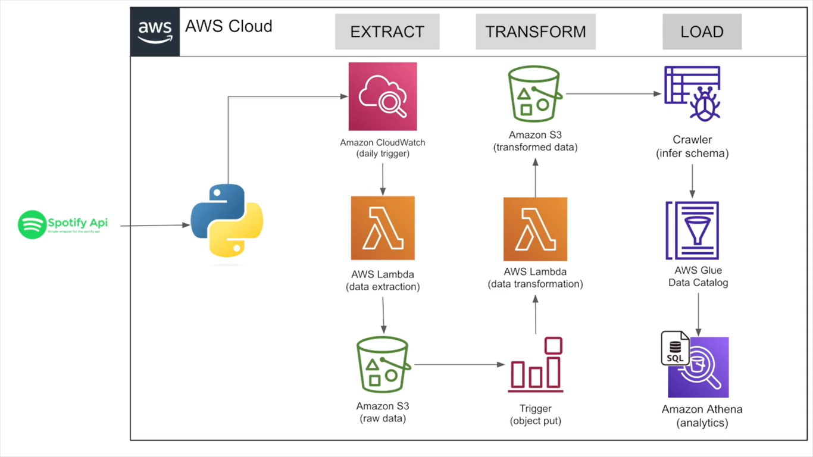

# 🎧 Spotify End-To-End Data Pipeline Project

## 🚀 Overview

This project demonstrates a fully automated data engineering pipeline that extracts, processes, and analyzes Spotify's Global Top Songs using APIs and AWS services. It showcases how modern cloud-native tools can enable seamless ETL workflows and facilitate advanced analytics.

## 🛠️ Architecture Diagram



*Please ensure the architecture diagram image is saved as `architecture_diagram.png` and placed in the `assets/images` directory of your repository.*

## 🔥 Features

- **Data Extraction:** Utilizes the Spotify API to retrieve real-time music data, including details such as artists, albums, and songs from a specified playlist.
- **Serverless Deployment:** Leverages AWS Lambda for efficient and scalable data extraction code deployment.
- **Automation Triggers:** Sets up EventBridge and S3 Event triggers for automatic execution, ensuring timely and consistent data updates.
- **Data Storage:** Organizes storage on Amazon S3 and creates analytics tables with AWS Glue and Athena to provide a comprehensive data pipeline.


 **Clone the Repository:**
   ```bash
   git clone https://github.com/sid-7878/Spotify-End-To-End-Data-Pipeline-Project.git
